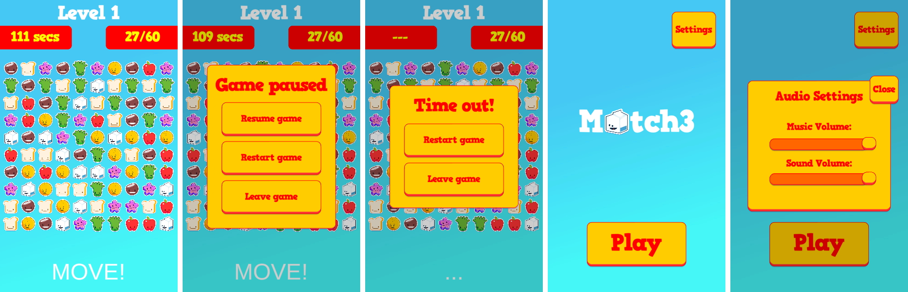
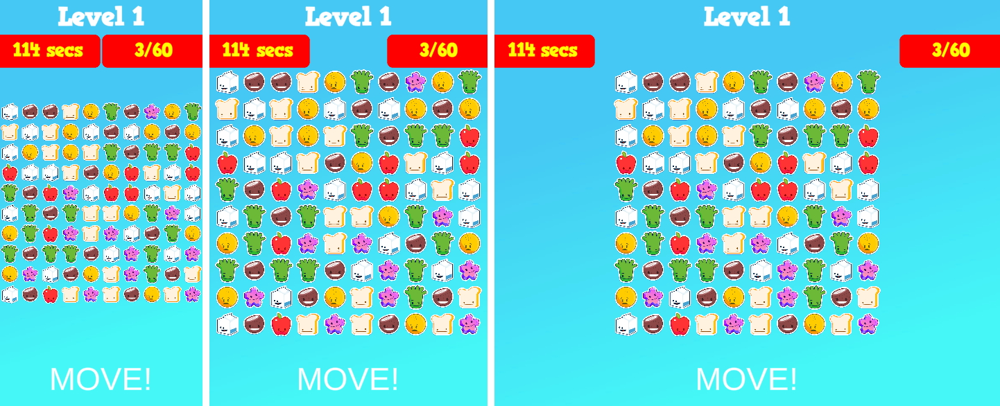
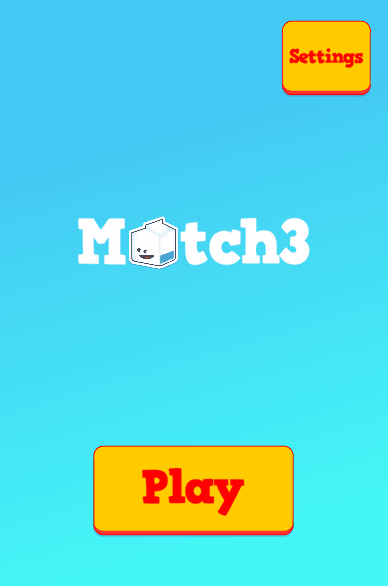

# Match 3




## About the project

Match 3 is an awnser to [PlayKids Match3 Test](https://github.com/PlayKids/match3-test), a knowledge test about Unity 3D and C#



---

### Getting Started:

##### Cloning the repository:

To open the project in development mode, you need to have an environment configured with [Unity 3D](https://store.unity.com/#plans-individual) (preferably: version ^2020)

``` 
git clone https://github.com/joveem/PlayKids-Match3-Test.git
cd PlayKids-Match3-Test
#
```